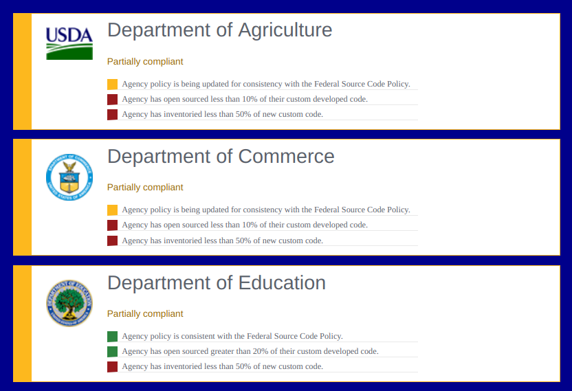

# compliance-dashboard-web-component
Reusable compliance dashboard web component

# demo
https://gsa.github.io/compliance-dashboard-web-component/

# basic usage
```html
<compliance dashboard config='YOUR-CONFIG-JSON-HERE' data='YOUR-DATA-JSON-HERE' /> 
```

# screenshot


# detailed usage
```html
<!DOCTYPE html>
<html style="background: darkblue;">
  <head>
    <title>Compliance Dashboard Web Component Demo</title>
    <script src="./index.js"></script>
  </head>
  <body style="max-width: 900px; padding: 3rem;">
    <div>
      <compliance-dashboard/>
    </div>
    <script>
      const configJSON = {
        scores: {
          'compliant': [1, null],
          'partial': [0.25, 0.9999999],
          'noncompliant': [null, 0.244444444]
        },
        text: [
          {
            req: "agencyWidePolicy",
            variants: {
              compliant: "Agency policy is consistent with the Federal Source Code Policy.",
              noncompliant: "Agency policy has not been reviewed for consistency with the Federal Source Code Policy.",
              partial: "Agency policy is being updated for consistency with the Federal Source Code Policy."
            }
          },
          {
            req: "openSourceRequirement",
            variants: {
              compliant: "Agency has open sourced greater than 20% of their custom developed code.",
              noncompliant: "Agency has open sourced less than 10% of their custom developed code.",
              partial: "Agency has open sourced greater than 10% of their custom developed code."
            }
          },
          {
            req: "inventoryRequirement",
            variants: {
              compliant: "Agency has inventoried 100% of new custom code.",
              noncompliant: "Agency has inventoried less than 50% of new custom code.",
              partial: "Agency has inventoried more than 50% of new custom code."
            }
          }
        ]
      };

      fetch("./example-data.json")
        .then(response => response.json())
        .then(dataJSON => {
          const dashboard = document.querySelector('compliance-dashboard');
          console.log("dashboard:", dashboard);
          dashboard.setAttribute('config', JSON.stringify(configJSON));
          dashboard.setAttribute('data', JSON.stringify(dataJSON));
        })
    </script>
  </body>
</html>
```

# contact
code@gsa.gov
